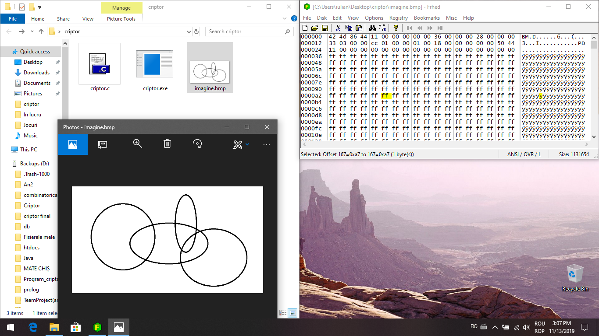
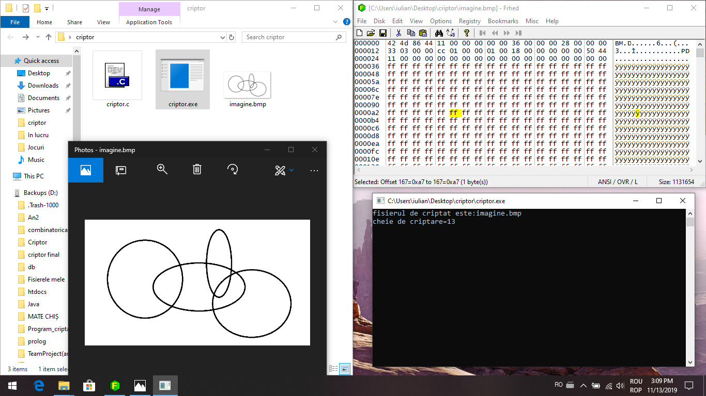
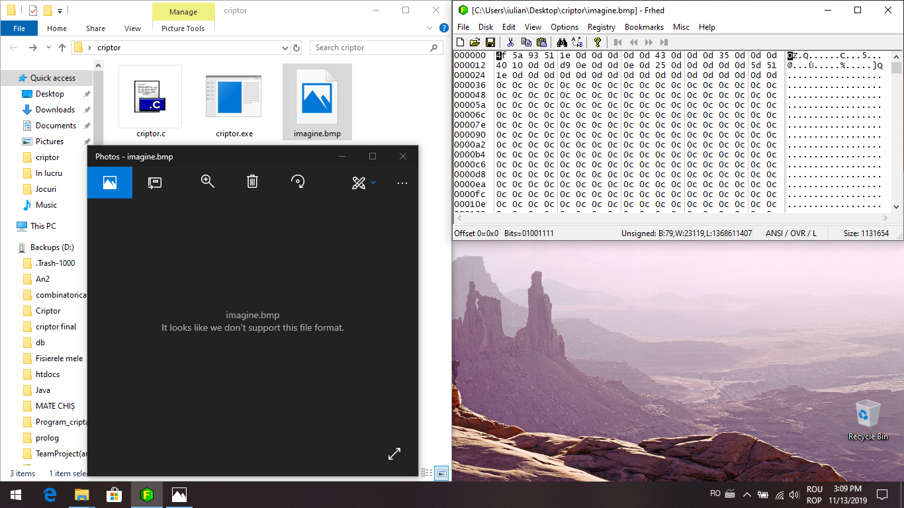

# Criptor-program-criptare-fisiere-
Acest program criptează un fișier, ce se află în locația curentă, incrementând fiecare bit al fișierului respectiv cu un întreg primit ca parametru 

Se poate observa că odată criptată imaginea nu mai este recunoscută de ImageViewere, iar biții din acest fișier s-au modificat
Decriptarea se poate face rulând încă odată executabilul de criptare cu cheia negativă
